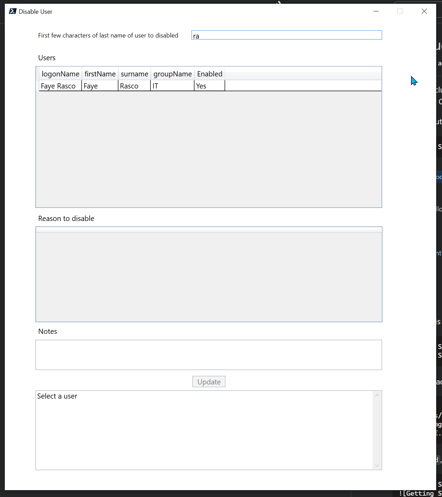

A collection of sample PowerShell scripts that connect to the Core API.
More details on the Core API are available here: https://forums.intercede.com/myid-12-7-integration-toolkit/myid-core-api-12-7/

#### Configure_OAuth.ps1
_Configure_OAuth.ps1_ helps to set up the MyID web.oauth2 web service configuration with an additional client. It makes use of _ConfigureSettings.psm1_ which contains functions for reading/updating a JSON file.
Further details available by running
```
PS > get-help .\Configure_OAuth.ps1 -Full
```

Note that newer versions of PowerShell are able to handle invalid JSON better in `Configure_OAuth.ps1`. PowerShell Core (https://github.com/PowerShell/PowerShell) is highly recommended.

#### getBearer.ps1
_getBearer.ps1_ is a standalone sample script showing how the OAuth bearer token can be captured from the MyID web.oauth2 web service given a client identifier and client secret.

#### MyID Core API helper module
The _Invoke-CoreAPI.psm1_ module makes interacting with the MyID Core API easier, and contains functions for:
- Creating a header token for authenticating to the MyID Core API (_Set-CoreAPIConnection_)
- Making a GET request to the MyID Core API (_Invoke-CoreAPIGet_)
- Making a PATCH request to the MyID Core API (_Invoke-CoreAPIPatch_)
- Making a POST request to the MyID Core API (_Invoke-CoreAPIPost_)

Sample usage of the above module is shown in the following sample scripts:
- _Import_LDAPUser_MyID_Core.ps1_: Authenticates to MyID, then Import a user from LDAP and request a device for them (optionally perform a directory sync at end)
- _Import_MyID_Core.ps1_: Authenticates to MyID, then Add a user with details defined in a CSV (ACastle2.CSV) and then request a device for that user.

The following scripts duplicate the behaviour of the https://github.com/intercede-sdk/manageDevice project, converting JavaScript code to PowerShell:
- _AddUserCreateRequest.ps1_: Adds a user and creates a request for them
- _FindUserCancelDevice.ps1_: Finds the user added above, and cancels a device issued to them (after the request in the first script is collected)

- _CancelDeviceForUser.ps1_: Finds a device owned by a user, and cancels the device - a more efficient way than _FindUserCancelDevice.ps1_ if owner details are unique

- _InteractiveDisableUser.ps1_: Disable user via an interactive console

- _GuiDisableUser.ps1_: Disable user via a GUI. GUI defined in XAML 

- _UpdateUser.ps1_: Update a user based on JSON input files. Two samples files, _nameChange.json_ and _nameChange2.json_ provided to show how legal name change can be applied. Note that changing Directory details (like DN/UPN, etc) requires MyID Configuration changes (details in the ps1 file).


#### More details on .ps1 scripts
Use the `get-help` feature of powershell to get further details on the above three scripts, for example:

```
PS > get-help .\Import_LDAPUser_MyID_Core.ps1 -Full
```


## Prerequisites

Refer to [3.1 Configuring MyID for server-to-server authentication](https://forums.intercede.com/wp-content/uploads/Flare/MyID-v1207-ent/index.htm#MyID%20Core%20API/Authentication/Configuring%20MyID%20for%20server-to-server%20authentication.htm?TocPath=APIs%257CMyID%2520Core%2520API%257C3%2520Server-to-server%2520authentication%257C_____1) in the MyID Documentation on initial set up.
If the above link doesn't work, you can navigate to the necessary page from https://forums.intercede.com/documentation/:
* Select MyID Version used
* Select APIs from left document tree
* Select MyID Core API
* Expand to section 3.1, Server-to-server authentication